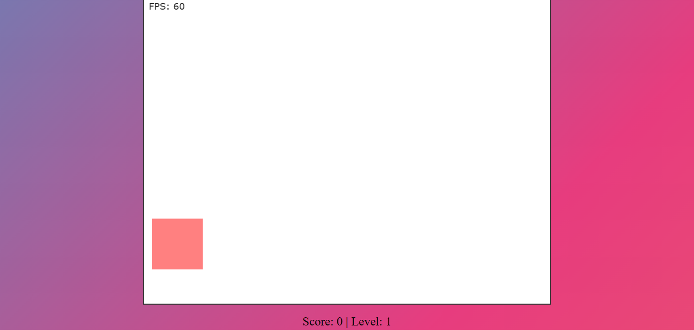

# javascript-canvas-bouncy-game 🎮

## Table of Contents 📜

- [Description](##description)
- [Features](##features)
- [Getting Started](##getting-started)
- [Usage](##usage)
- [Contributing](##contributing)
- [License](##license)

## Description 📝

The Canvas Box Bounce Game is a fun and interactive HTML5 game where you control a bouncing square. Your goal is to click on the square as it moves around the canvas to earn points and increase your score. With each successful click, the square's speed increases, making the game more challenging as you progress. 🚀

## Features 🌟

- Responsive design for various screen sizes.
- Real-time FPS display.
- Engaging sound effects 🔊.
- Increasing difficulty with each level.
- Scoreboard to track your progress.

## Getting Started 🚀

Follow these steps to set up the project locally:

1. Clone the repository: `git clone https://github.com/riteshporiya/javascript-canvas-bouncy-game.git`
2. Open `index.html` in your preferred web browser.

## Usage 🎯

1. Move your mouse to control the cursor.
2. Click on the square to earn points.
3. As you score more points, the game becomes faster and more challenging.
4. Try to achieve the highest score possible! 🏆

## Contributing 🤝

We welcome contributions from the community! If you'd like to contribute to this project, please follow these guidelines:

1. Fork the repository.
2. Create a new branch: `git checkout -b feature/your-feature-name`
3. Make your changes and commit them: `git commit -m "Add your feature"`
4. Push to the branch: `git push origin feature/your-feature-name`
5. Submit a pull request.

## License 📄

This project is licensed under the MIT License - see the [LICENSE](LICENSE) file for details.
